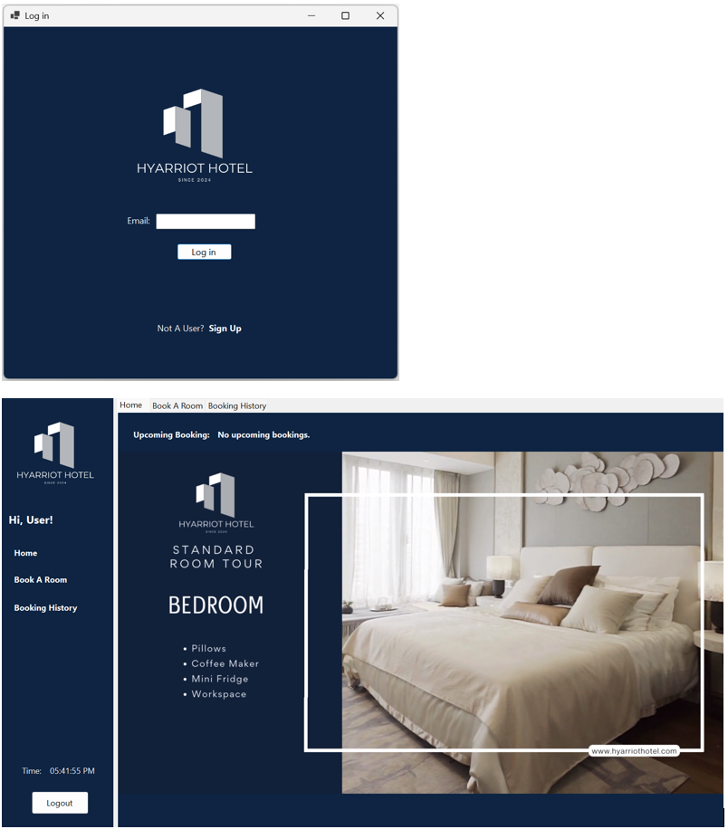
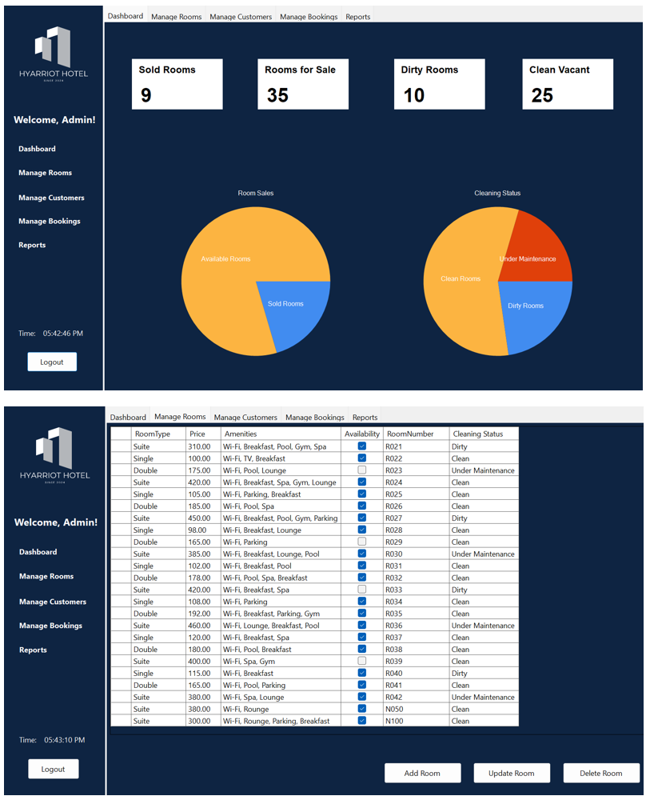
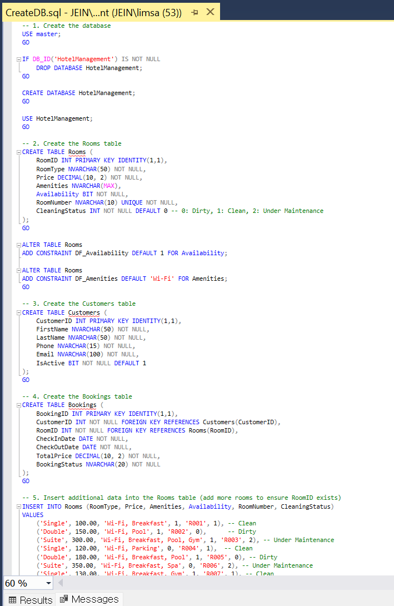

# Hotel Management System 

🎥 Demo Video: <a href="https://www.youtube.com/watch?v=MNdH53IKr50&ab_channel=jein" target="_blank">View My Video</a>

🖼️ Preview Image

📋 Description
-The Hyarriot Hotel Management System is a Windows Forms application designed to streamline hotel operations. 
 It enables administrators to manage bookings, rooms, customers, and reports, 
 while providing customers with an intuitive interface to search for available rooms, make or cancel reservations, and complete payments.

✨ Features
- Room availability search based on date
- Customer booking & cancellation system
- Secure payment processing
- Administrative dashboard for:
  - Room and pricing management
  - Customer data overview
  - Report generation

🛠️ Skills
- C# - Core language for WinForms development  
- .NET Framework - Windows application platform  
- SQL Server - Database backend  
- Windows Forms (WinForms) - User interface  
- ADO.NET - Data access layer  
- Visual Studio - Development environment

